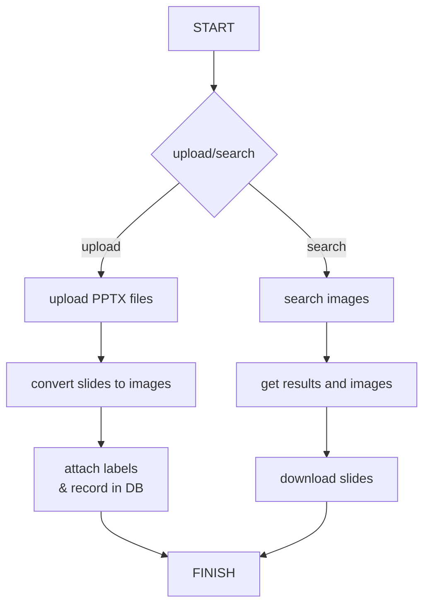

# ix3-TMT 
ix3-TMT(Team-Management-Tool) is a tool for managing digital consultancy team-delivered professional reports.

ix3-TMT是一款可以"一目了然"的簡報素材查找與分享方案



## 先前準備 ##
需先準備Ubuntu版本18.04以上的Linux發行版本。

### 使用到php套件
```
apt install php libapache2-mod-php
php -v
```

## 報告管理 ##
團隊個人撰寫的專業報告，除了計算交付數量外，亦在團隊內交流使用。

### converters ###
#### PPT to PDF to PNG
引用： hadwinzhy/convert-ppt-to-jpg
<pre><code>sudo apt-get update && sudo apt-get install -y libreoffice openjdk-8-jdk imagemagick</code></pre>

<pre><code>#!/bin/bash

path=${1}

mkdir -p converted_jpg
##################### ppt & pptx #####################
if [[ "$path" == *"ppt"* ]]; then
  soffice --headless --convert-to pdf $path --outdir converted_jpg/
  cd converted_jpg
  convert -verbose -density 150 *.pdf -quality 100 $path".jpg"
  rm -rf *.pdf
  cd -
fi

####################### keynote ######################
if [[ "$path" == *"key"* ]]; then
   echo 'wait for keynote'
fi

echo 'please check folder converted_jpg'
</code></pre>

- 需ImageMagick修改參數
<pre><code>sudo sed -i 's/policy domain="coder" rights="none" pattern="PDF"/policy domain="coder" rights="read|write" pattern="PDF"/g' /etc/ImageMagick-6/policy.xml</code></pre>


#### 圖像呈現 ####
參考：
 - 分個人製作的內容
   - with TAG  
 - 圖像說明: 連結原檔案 (同 bootstrap-image-layout)
   - https://adorable-daifuku-580c57.netlify.app/
 - 交付分享統計:
   - superset (處理中)
 - ppt to txt (es/Quickwit儲存+中文分詞器)
 - AI Search
