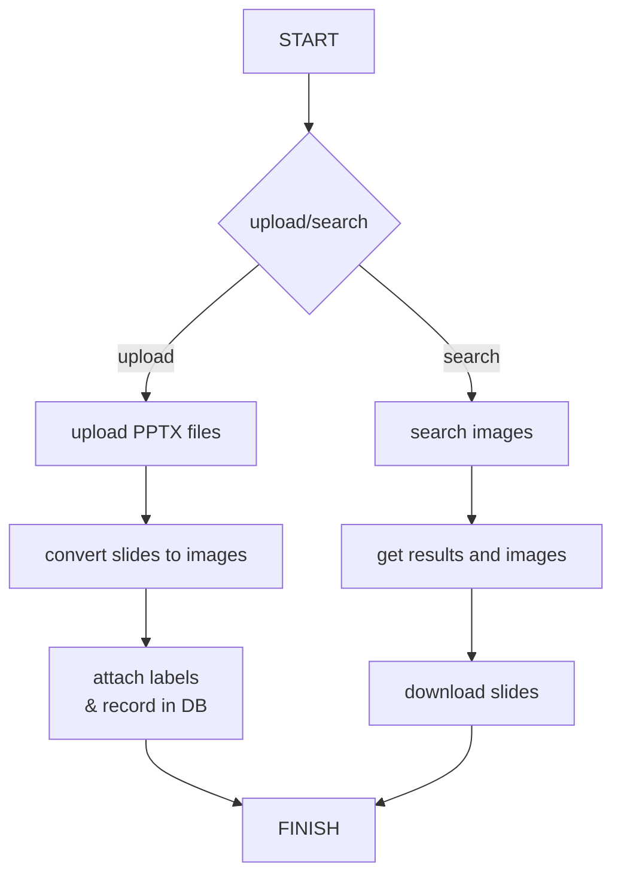

# ix3-TMT 
ix3-TMT(Team-Management-Tool) is a tool for managing digital consultancy team-delivered professional reports.
ix3-TMT是一款可以"一目了然"的簡報素材查找與分享方案，用於團隊交付管理與知識查找



## 先前準備 ##
需先準備Ubuntu版本18.04以上的Linux發行版本。

### 使用到php套件
```
apt install php libapache2-mod-php
php -v
```

## 報告管理 ##
團隊個人撰寫的專業報告，除了計算交付數量外，亦在團隊內交流使用。

### converters ###
#### PPT to PDF to PNG
引用： hadwinzhy/convert-ppt-to-jpg
<pre><code>sudo apt-get update 
sudo apt-get install -y libreoffice openjdk-8-jdk imagemagick</code></pre>

<pre><code>#!/bin/bash

path=${1}

mkdir -p converted_jpg
##################### ppt & pptx #####################
if [[ "$path" == *"ppt"* ]]; then
  soffice --headless --convert-to pdf $path --outdir converted_jpg/
  cd converted_jpg
  convert -verbose -density 150 *.pdf -quality 100 $path".jpg"
  rm -rf *.pdf
  cd -
fi

####################### keynote ######################
if [[ "$path" == *"key"* ]]; then
   echo 'wait for keynote'
fi

echo 'please check folder converted_jpg'
</code></pre>

- 需ImageMagick修改參數
<pre><code>sudo sed -i 's/policy domain="coder" rights="none" pattern="PDF"/policy domain="coder" rights="read|write" pattern="PDF"/g' /etc/ImageMagick-6/policy.xml</code></pre>

#### PNG Resize (預覽圖)
```
from PIL import Image

# Open the original PNG image
try:
    img = Image.open('input.png')
except FileNotFoundError:
    print("Error: 'input.png' not found. Please ensure the image is in the same directory or provide the full path.")
    exit()

# Define the new dimensions
new_width = 400
new_height = 300

# Resize the image
resized_img = img.resize((new_width, new_height))

# Save the resized image
resized_img.save('output_resized.png')

print(f"Image resized to {new_width}x{new_height} and saved as 'output_resized.png'")

# Example of resizing while maintaining aspect ratio
basewidth = 200
wpercent = (basewidth / float(img.size[0]))
hsize = int((float(img.size[1]) * float(wpercent)))
resized_img_aspect_ratio = img.resize((basewidth, hsize), Image.Resampling.LANCZOS) # Using LANCZOS for better quality
resized_img_aspect_ratio.save('output_resized_aspect_ratio.png')
print(f"Image resized with aspect ratio maintained to width {basewidth} and saved as 'output_resized_aspect_ratio.png'")
```


#### 欄位
- id uuid v7
- file_name 檔案名稱
- file_size 檔案大小
- file_pages 檔案頁數
- file_path 檔案路徑
- file_remark 描述
- file_tag 標籤
- upload_date 上傳日期
- uploader 上傳者
- cnt_dl 下載次數
- cnt_star 星號

#### 圖像呈現 ####
參考：
 - 分個人製作的內容
   - with TAG  
 - 圖像說明: 連結原檔案 (同 bootstrap-image-layout)
   - https://adorable-daifuku-580c57.netlify.app/
 - 交付分享統計:
   - superset (參考：https://www.sabbirz.com/blog/install-apache-superset-on-ubuntu-a-complete-step- )
   - 待中文化 (https://github.com/lutinglt/superset-zh)
```
sudo apt update
sudo apt upgrade
sudo apt-get install micro build-essential libssl-dev libffi-dev python3-dev python3-pip libsasl2-dev libldap2-dev default-libmysqlclient-dev
sudo apt install python3.12-venv
sudo apt install python3.12-dev
pip install --upgrade pip setuptools wheel pillow 
pip install apache-superset --break-system-packages
export SUPERSET_SECRET_KEY=***********
export FLASK_APP=superset
pip install marshmallow==3.20.1 --break-system-packages
superset db upgrade
superset fab create-admin
superset load-examples
superset init
superset run -h 0.0.0.0 -p 8088
```  

 - ppt to txt (es/Quickwit儲存+中文分詞器)
 - AI Search


2025/10/8：比較Open Slideshare 相同功能 https://ryuzee.github.io/open-slideshare/
  - Open Slideshare 呈現方式是以投影片封面，TMT 是將投影片展開打散呈現每一頁，更能幫助快速瀏覽
  - Open Slideshare 使用情境式展示/查詢投影片
  - 可選整併 Open Slideshare 的基礎架構
