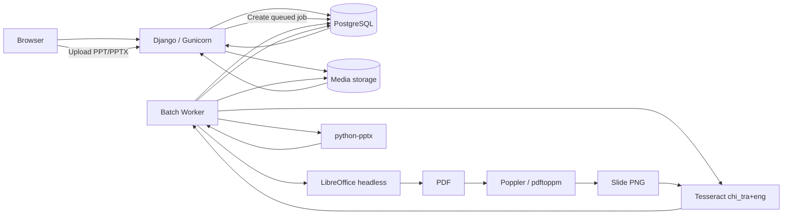

# ix3-TMT — Team Knowledge & Slide Intelligence Platform

> 把團隊散落在 PowerPoint 裡的知識，轉成「一頁一頁可搜尋、可收藏、可再利用」的顧問知識庫。

ix3-TMT 原本是 Team Management Tool 的概念驗證專案。2.0 版重新設計為 **Slide-first knowledge platform**：PowerPoint 是來源容器，每一頁 Slide 才是一級知識物件。

同仁可以上傳 PPT/PPTX；背景 Worker 會批次將簡報轉成投影片圖片，抽取 PPT 原生文字，對圖片型或文字不足的頁面執行繁體中文＋英文 OCR，最後把每頁內容放進可搜尋的知識牆。使用者可以 Star、建立自己的收藏夾、留下個人書籤備註；系統也會統計有效貢獻頁數、收到的 Stars、不同 Star 使用者與閱讀次數。

本版本的核心功能 **不需要 GPU，也不需要外部 AI API**。設計目標之一就是能放在一般 Ubuntu 小主機（例如 i5 / 32 GB RAM）長期運行。

---

## 功能

### Slide-first 知識庫
- PPT/PPTX 上傳與批次處理。
- LibreOffice headless：PowerPoint → PDF。
- Poppler：PDF → 每頁 PNG。
- WebP 縮圖，適合大量圖像瀏覽。
- 每一頁 Slide 有獨立 URL、標題、摘要、Tag、來源與原始簡報追溯。
- 原始簡報下載仍保留權限檢查。

### OCR 與文字抽取
- `python-pptx` 優先抽取原生文字、表格、群組物件與 notes。
- 預設使用 Tesseract 5：`chi_tra+eng`。
- **不是每頁都 OCR**：只有原生文字很少，或有圖表/圖片且文字偏少時才 OCR。
- OCR 預設 PSM 11，較適合投影片上分散的小文字與圖表標籤。
- 原生文字、OCR 文字分開保存，未來可以重新 OCR 而不用重新解析 PPT。

### 搜尋
- Slide title / 原生文字 / OCR /摘要 / Tags / Deck metadata 搜尋。
- 多關鍵字 AND 篩選。
- PostgreSQL 部署會自動啟用 `pg_trgm`，替 Slide `search_text` 與 `title` 建立 trigram GIN index，改善繁中 `ILIKE`/substring 查詢。
- SQLite 也可運行，適合單機試用。

### 個人整理
- Star：表示「這張 Slide 有價值」。
- Collection：用自己的分類方式整理 Star/Slide。
- 同一張 Slide 可放進多個 Collection。
- 每個書籤可以寫自己的備註。

### 貢獻統計
- 完成簡報數。
- 有效投影片頁數。
- 收到 Stars。
- 不同 Star 使用者數。
- 閱讀次數。
- 被不同同仁收藏的情況。
- 團隊貢獻榜不合併成一個「可刷分」總分。

### 權限
Deck 可設定：
- `全體同仁`
- `指定群組/人員`
- `機密（指定人員）`
- `僅自己`

Slide 圖檔、縮圖、原始 PPT 都不是公開 media URL；每一次讀取都會先通過 Django 權限判斷。

---

## 系統架構


```mermaid
flowchart LR
    U[Browser] --> W[Django / Gunicorn]
    W --> DB[(PostgreSQL)]
    W --> FS[(Media storage)]

    U -->|Upload PPT/PPTX| W
    W -->|Create queued job| DB

    WK[Batch Worker] --> DB
    WK --> LO[LibreOffice headless]
    LO --> PDF[PDF]
    PDF --> PP[Poppler / pdftoppm]
    PP --> IMG[Slide PNG]
    WK --> PPTX[python-pptx]
    WK --> OCR[Tesseract chi_tra+eng]
    IMG --> OCR
    PPTX --> WK
    OCR --> WK
    WK --> DB
    WK --> FS

    DB --> W
    FS --> W
```

處理順序：

```text
Upload
  ↓
ProcessingJob: QUEUED
  ↓
LibreOffice → PDF
  ↓
pdftoppm → Slide PNG
  ↓
python-pptx native text
  ↓
文字不足 / 圖片型 Slide ?
  ├─ No  → skip OCR
  └─ Yes → Tesseract chi_tra+eng
  ↓
summary + keywords/tags
  ↓
thumbnail WebP
  ↓
Slide records + search_text
  ↓
Deck: READY
```

更多設計細節見 [`docs/ARCHITECTURE.md`](docs/ARCHITECTURE.md)。

---

# 快速安裝：Docker Compose（建議）

這是最適合第一次在新機器架設的方式。Docker 版已包含：

- Python / Django
- PostgreSQL 16
- LibreOffice Impress
- Poppler
- Tesseract OCR
- `eng`
- `chi_tra`
- Noto CJK fonts
- Web service
- Background worker

## 1. Clone

```bash
git clone https://github.com/linjose/ix3-TMT.git
cd ix3-TMT
```

## 2. 建立 `.env`

```bash
cp .env.example .env
```

產生 Django secret：

```bash
python3 -c 'import secrets; print(secrets.token_urlsafe(64))'
```

編輯：

```bash
nano .env
```

至少修改：

```dotenv
DJANGO_SECRET_KEY=貼上剛剛產生的值
DJANGO_DEBUG=0
DJANGO_ALLOWED_HOSTS=192.168.1.50,127.0.0.1,localhost

DB_NAME=tmt
DB_USER=tmt
DB_PASSWORD=請換成強密碼
```

`DJANGO_ALLOWED_HOSTS` 要加入同事實際用來連線的 hostname 或內網 IP。

## 3. 啟動

```bash
docker compose up -d --build
```

確認：

```bash
docker compose ps
```

應看到 `db`、`web`、`worker` 都在運行。

## 4. 建立第一個管理員

```bash
docker compose exec web python manage.py createsuperuser
```

## 5. 開啟

預設：

```text
http://SERVER_IP:8000/
```

管理後台：

```text
http://SERVER_IP:8000/admin/
```

## 6. 看處理紀錄

```bash
docker compose logs -f worker
```

Web：

```bash
docker compose logs -f web
```

---

# Ubuntu 24.04 原生安裝

如果公司環境不能使用 Docker，可以直接安裝在 Ubuntu 24.04。

## A. 快速單機試跑（SQLite）

### 1. 安裝 OS 套件

```bash
sudo ./scripts/install_ubuntu.sh
```

腳本會啟用 Ubuntu `universe` repository（繁體中文 Tesseract 語言包位於該 repository），再安裝需要的套件。

這會安裝：

```text
python3 / venv / pip
LibreOffice
Poppler
Tesseract
繁中與英文 OCR language packs
Noto CJK fonts
PostgreSQL
Nginx
```

### 2. 建立設定

```bash
cp .env.example .env
nano .env
```

若要先用 SQLite：

```dotenv
DB_HOST=
DJANGO_DEBUG=1
DJANGO_ALLOWED_HOSTS=127.0.0.1,localhost,你的內網IP
```

### 3. Python environment

若安裝腳本已完成，可直接：

```bash
source .venv/bin/activate
```

否則：

```bash
python3 -m venv .venv
source .venv/bin/activate
pip install -U pip wheel
pip install -r requirements.txt
```

### 4. DB migration

```bash
python manage.py migrate
python manage.py tmt_check
```

`tmt_check` 會一次檢查 DB、media 寫入權限、LibreOffice、Poppler、Tesseract 與 `chi_tra+eng` 語言包。

### 5. 建立管理員

```bash
python manage.py createsuperuser
```

### 6. 啟動 Web

Terminal 1：

```bash
python manage.py runserver 0.0.0.0:8000
```

### 7. 啟動 Worker

Terminal 2：

```bash
source .venv/bin/activate
python manage.py process_jobs --loop --poll-seconds 30
```

這樣就能完整測試：

```text
上傳 PPT → Worker → Slide images → OCR → Search → Star → Collection
```

---

# Ubuntu 24.04 + PostgreSQL + Systemd（正式內網部署）

## 1. 建 PostgreSQL database

```bash
sudo -u postgres psql
```

在 psql：

```sql
CREATE USER tmt WITH PASSWORD '請使用強密碼';
CREATE DATABASE tmt OWNER tmt;
\q
```

`.env`：

```dotenv
DB_NAME=tmt
DB_USER=tmt
DB_PASSWORD=同上密碼
DB_HOST=127.0.0.1
DB_PORT=5432

DJANGO_DEBUG=0
DJANGO_ALLOWED_HOSTS=tmt.example.internal,192.168.1.50
```

第一次 migrate 時，PostgreSQL 會由 migration 自動嘗試：

```sql
CREATE EXTENSION IF NOT EXISTS pg_trgm;
```

並建立 Slide trigram indexes。

## 2. 建議目錄

正式服務範例：

```text
/opt/ix3-TMT
```

建立 service account：

```bash
sudo useradd --system --user-group --home-dir /opt/ix3-TMT --shell /usr/sbin/nologin tmt || true
sudo mkdir -p /opt/ix3-TMT
sudo rsync -a --exclude .git ./ /opt/ix3-TMT/
sudo chown -R tmt:tmt /opt/ix3-TMT
```

建立 venv：

```bash
sudo -u tmt python3 -m venv /opt/ix3-TMT/.venv
sudo -u tmt /opt/ix3-TMT/.venv/bin/pip install -U pip wheel
sudo -u tmt /opt/ix3-TMT/.venv/bin/pip install -r /opt/ix3-TMT/requirements.txt
```

## 3. EnvironmentFile

```bash
sudo cp /opt/ix3-TMT/.env.example /etc/ix3-tmt.env
sudo nano /etc/ix3-tmt.env
sudo chmod 600 /etc/ix3-tmt.env
sudo chown root:root /etc/ix3-tmt.env
```

填好：

```dotenv
DJANGO_SECRET_KEY=...
DJANGO_DEBUG=0
DJANGO_ALLOWED_HOSTS=...
DB_NAME=tmt
DB_USER=tmt
DB_PASSWORD=...
DB_HOST=127.0.0.1
DB_PORT=5432
TZ=Asia/Taipei
TMT_OCR_ENABLED=1
TMT_OCR_LANGUAGES=chi_tra+eng
TMT_RENDER_DPI=160
```

> systemd `EnvironmentFile` 請使用單純的 `KEY=value`，不要寫 `export`。

## 4. Migrate / static / admin

```bash
cd /opt/ix3-TMT
sudo -u tmt env $(sudo cat /etc/ix3-tmt.env | xargs) .venv/bin/python manage.py migrate
sudo -u tmt env $(sudo cat /etc/ix3-tmt.env | xargs) .venv/bin/python manage.py collectstatic --noinput
sudo -u tmt env $(sudo cat /etc/ix3-tmt.env | xargs) .venv/bin/python manage.py createsuperuser
```

如果 `.env` 的值有空白或特殊字元，建議改用 shell：

```bash
sudo -u tmt bash
set -a
source /etc/ix3-tmt.env
set +a
cd /opt/ix3-TMT
.venv/bin/python manage.py migrate
```

## 5. Systemd

```bash
sudo cp deploy/systemd/ix3-tmt-web.service /etc/systemd/system/
sudo cp deploy/systemd/ix3-tmt-worker.service /etc/systemd/system/
sudo systemctl daemon-reload
sudo systemctl enable --now ix3-tmt-web ix3-tmt-worker
```

確認：

```bash
systemctl status ix3-tmt-web
systemctl status ix3-tmt-worker
journalctl -u ix3-tmt-worker -f
```

Worker 預設有：

```text
Nice=10
IOSchedulingClass=idle
```

所以 OCR/轉圖在小主機上會盡量避免搶走 Web service 的互動資源。

## 6. Nginx

```bash
sudo cp deploy/nginx/ix3-tmt.conf /etc/nginx/sites-available/ix3-tmt
sudo ln -s /etc/nginx/sites-available/ix3-tmt /etc/nginx/sites-enabled/ix3-tmt
sudo nano /etc/nginx/sites-available/ix3-tmt
```

修改：

```nginx
server_name tmt.example.internal;
```

測試並 reload：

```bash
sudo nginx -t
sudo systemctl reload nginx
```

Nginx 範例已設：

```nginx
client_max_body_size 110m;
```

若你把 `TMT_MAX_UPLOAD_MB` 調到大於 100 MB，也要同步調整 Nginx。

---

# 如果你真的只想「每 10 分鐘批次跑」

不必常駐 Worker。

停掉：

```bash
sudo systemctl disable --now ix3-tmt-worker
```

用 `tmt` 使用者的 crontab：

```bash
sudo -u tmt crontab -e
```

加入：

```cron
*/10 * * * * cd /opt/ix3-TMT && /usr/bin/env bash -c 'set -a; source /etc/ix3-tmt.env; set +a; .venv/bin/python manage.py process_jobs --max-jobs 10' >> /tmp/ix3-tmt-worker.log 2>&1
```

這就是「上傳先排隊，每 10 分鐘處理一批」。

---

# SH87 / 小型 CPU 主機建議設定

建議先維持：

```dotenv
TMT_OCR_ENABLED=1
TMT_OCR_LANGUAGES=chi_tra+eng
TMT_OCR_TRIGGER_TEXT_LENGTH=50
TMT_OCR_VISUAL_TRIGGER_TEXT_LENGTH=250
TMT_OCR_PSM=11
TMT_RENDER_DPI=160
TMT_THUMBNAIL_WIDTH=640
TMT_OCR_TIMEOUT_SECONDS=120
```

並且只跑 **一個 Worker process**。

不要因為 CPU 有 4/8 threads 就一次開 4 個 LibreOffice/OCR jobs。這個系統的設計本來就是允許非即時處理。

如果 OCR 對 Gartner/McKinsey 等小字圖表辨識率不夠，可先把：

```dotenv
TMT_RENDER_DPI=200
```

再測；代價是處理時間、暫存空間與 CPU 都會增加。

---

# OCR 檢查

Ubuntu：

```bash
tesseract --version
tesseract --list-langs | grep -E 'eng|chi_tra'
```

應至少看到：

```text
chi_tra
eng
```

LibreOffice：

```bash
soffice --version
```

Poppler：

```bash
pdftoppm -v
```

---

# 處理 Job

一次處理目前所有 queued jobs：

```bash
python manage.py process_jobs
```

最多處理 5 個：

```bash
python manage.py process_jobs --max-jobs 5
```

常駐：

```bash
python manage.py process_jobs --loop
```

指定 polling：

```bash
python manage.py process_jobs --loop --poll-seconds 60
```

失敗的 Deck 可以從 Web 畫面按「重新排程」。

---

# 帳號管理

預設：

```dotenv
TMT_ALLOW_SELF_SIGNUP=0
```

適合企業內部：由 admin 建立帳號。

Django admin：

```text
/admin/
```

管理員可：
- 建立 User。
- 建 Group，例如 `AI Team`、`Healthcare Team`。
- 將人員加入 Group。
- 檢查 Deck / Slide / ProcessingJob。

若只是公開 demo，可設：

```dotenv
TMT_ALLOW_SELF_SIGNUP=1
```

正式企業環境建議保持關閉，未來再串 LDAP/OIDC/SSO。

---

# 權限模型

| Visibility | 可看的人 |
|---|---|
| 全體同仁 | 所有登入使用者 |
| 指定群組/人員 | owner、staff、指定 User/Group |
| 機密 | owner、staff、指定 User/Group |
| 僅自己 | owner、staff |

`staff` 是主管/系統管理用途，因此可以跨權限檢視內容與完整排行榜。

**重要：** 不要在 Nginx 直接公開 `/media/`。Slide 圖片與原始簡報目前刻意由 Django authenticated views 提供，避免機密圖檔因為知道 path 就被直接下載。

更多見 [`SECURITY.md`](SECURITY.md)。

---

# 第三方顧問資料 / Gartner 等內容

ix3-TMT 可以索引組織有權使用的第三方投影片或圖片，但軟體本身**不會取得或授權第三方受著作權保護的內容**。

上傳時提供：

```text
source_title
source_author
source_publisher
source_url
copyright_notice
```

建議組織自行訂定內部規範，例如：
- 僅放已合法取得、可供該組織內部使用的資料。
- 保留來源與授權範圍。
- 不因為能 OCR 就代表可以重新散布第三方作品。
- 對機密/客戶資料設定 Restricted/Confidential。

---

# 備份

真正要備份的是兩部分：

1. PostgreSQL database
2. `media`（原始 PPT + slide images + thumbnails）

Database：

```bash
pg_dump -h 127.0.0.1 -U tmt -Fc tmt > tmt-$(date +%F).dump
```

Media：

```bash
tar -czf tmt-media-$(date +%F).tgz /opt/ix3-TMT/media
```

Docker：

```bash
docker compose exec -T db pg_dump -U tmt -Fc tmt > tmt.dump
```

不要只備份 DB；圖片與原始 PowerPoint 在 filesystem/volume。

---

# 更新

```bash
git pull
source .venv/bin/activate
pip install -r requirements.txt
python manage.py migrate
python manage.py collectstatic --noinput
sudo systemctl restart ix3-tmt-web ix3-tmt-worker
```

Docker：

```bash
git pull
docker compose up -d --build
```

`init` container 會跑 migration 與 collectstatic。

---

# Troubleshooting

## 上傳後一直「排程中」

確認 Worker：

```bash
systemctl status ix3-tmt-worker
journalctl -u ix3-tmt-worker -n 200 --no-pager
```

或 Docker：

```bash
docker compose logs --tail=200 worker
```

手動：

```bash
python manage.py process_jobs --max-jobs 1
```

## `找不到 LibreOffice soffice`

```bash
sudo apt install libreoffice
which soffice
```

## `找不到 pdftoppm`

```bash
sudo apt install poppler-utils
which pdftoppm
```

## `Failed loading language 'chi_tra'`

```bash
sudo apt install tesseract-ocr-chi-tra tesseract-ocr-eng
tesseract --list-langs
```

## 中文字型跑掉

```bash
sudo apt install fonts-noto-cjk
sudo fc-cache -f -v
```

LibreOffice 仍可能因原始簡報使用未安裝的企業字型而產生版面差異。正式環境應安裝組織合法授權的對應字型。

## PPT 轉 PDF 失敗

先用同一台主機手動測：

```bash
mkdir -p /tmp/tmt-test
soffice --headless --convert-to pdf --outdir /tmp/tmt-test sample.pptx
```

## OCR 太慢

優先不要開多 Worker；先降低：

```dotenv
TMT_RENDER_DPI=140
```

或提高 OCR trigger：

```dotenv
TMT_OCR_TRIGGER_TEXT_LENGTH=80
TMT_OCR_VISUAL_TRIGGER_TEXT_LENGTH=350
```

注意：trigger 越高代表**更多頁面會做 OCR**；若要減少 OCR，應降低 `VISUAL_TRIGGER`，或直接關閉：

```dotenv
TMT_OCR_ENABLED=0
```

## OCR 漏掉圖表上的散落文字

試：

```dotenv
TMT_RENDER_DPI=200
TMT_OCR_PSM=11
```

若是密集段落反而效果不好，可測：

```dotenv
TMT_OCR_PSM=6
```

---

# 搜尋設計與規模

目前版本刻意不引入 Elasticsearch/OpenSearch，降低小主機維運成本。

PostgreSQL 模式：
- `search_text` 保留完整 native/OCR/Tag 內容。
- `pg_trgm` GIN index 加速繁中 substring search。
- 對初期數千到數萬 Slide 的內部知識庫已相當實用。

如果未來成長到非常大量資料，可把 Search backend 抽換為：
- PostgreSQL + pgvector hybrid search
- OpenSearch
- Quickwit

資料模型不需重新回到「檔案為中心」。

---

# AI / VLM 為什麼現在不是必要依賴？

2.0 第一版的原則：

```text
沒有 GPU
沒有 OpenAI API
沒有外部網路
```

仍能：

```text
PPT upload
→ slide conversion
→ native text
→ OCR
→ search
→ Star
→ Collection
→ contribution analytics
```

未來可加入：
- Local embedding / pgvector
- Local VLM 圖表理解
- LLM summary
- Semantic search
- Similar slides
- 自動知識分類
- Expertise map
- Collection → 新簡報草稿

對 Restricted/Confidential Deck，未來若串外部 AI，也應提供 `local only / external enterprise API / no AI` policy。

---

# Project layout

```text
ix3-TMT/
├── config/                 Django project settings
├── tmt/
│   ├── models.py           Deck / Slide / Star / Collection / Job
│   ├── views.py
│   ├── forms.py
│   ├── services/
│   │   ├── processing.py   PPT → PDF → PNG → OCR → DB
│   │   ├── text_extract.py python-pptx + tags + summary
│   │   └── ocr.py          Tesseract adapter
│   ├── management/commands/process_jobs.py
│   ├── templates/
│   └── static/
├── deploy/
│   ├── nginx/
│   └── systemd/
├── scripts/
├── docs/
├── legacy/                 v1 PoC files kept for reference
├── Dockerfile
├── docker-compose.yml
├── requirements.txt
└── manage.py
```

---

# Development

SQLite 是預設 fallback，所以開發不一定要先裝 PostgreSQL：

```bash
cp .env.example .env
# leave DB_HOST empty
python3 -m venv .venv
source .venv/bin/activate
pip install -r requirements-dev.txt
python manage.py migrate
python manage.py createsuperuser
python manage.py runserver
```

另一個 terminal：

```bash
source .venv/bin/activate
python manage.py process_jobs --loop
```

Tests：

```bash
python manage.py test
python -m compileall -q config tmt
```

GitHub Actions 會跑 Django check / migration / tests / compileall。

---

# Known limitations

- `.pptx`：可同時取得原生 XML 文字與 OCR。
- 舊 `.ppt`：LibreOffice 可轉圖，但 `python-pptx` 不能直接解析；搜尋文字主要依 OCR。
- Apple Keynote `.key` 尚未支援，請先輸出 PPTX/PDF。
- SmartArt、圖表、截圖文字不一定能由 `python-pptx` 完整取得，因此條件式 OCR 是必要 fallback。
- LibreOffice 的字型/排版可能和 Microsoft PowerPoint 有差異。
- 目前摘要是 deterministic offline 摘要（截取重要文字），不是 LLM summary。
- 目前 Tag 是本地 keyword extraction，不是 AI taxonomy。
- 尚未內建企業 OIDC/LDAP/AD SSO；可使用 Django auth + Group。
- 不會自動判斷第三方文件的著作權授權範圍。

---

# Legacy v1

原本的 Bootstrap/PHP/Shell PoC 沒有刪掉，已移到：

```text
legacy/
```

其中舊 `pptx_to_md.py` 的核心想法已重新整合進 2.0 `tmt/services/text_extract.py`。

---

# License

MIT. See [`LICENSE`](LICENSE).

Copyright © 2024–2026 José Lin.
