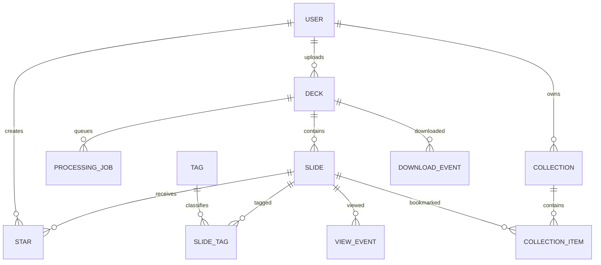

# ix3-TMT Architecture

## Product model

The central architectural decision is **Slide-first, not File-first**.

```text
Deck (source container)
  ├─ Slide 1
  ├─ Slide 2
  ├─ Slide 3
  └─ ...
```

Search, Star, Collection, view metrics and future semantic embeddings belong primarily to `Slide`.

## Data model



## Processing pipeline

`ProcessingJob` is a lightweight database queue. No Redis/RabbitMQ/Celery is required for the initial deployment.

Worker algorithm:

1. Claim oldest `queued` job under DB row lock.
2. Set job/deck to running/processing.
3. Convert PowerPoint to PDF with an isolated LibreOffice user profile.
4. Render each page with Poppler `pdftoppm`.
5. Extract native PPTX text with `python-pptx`.
6. Decide if OCR is needed.
7. Run Tesseract for selected pages.
8. Build deterministic summary and keywords.
9. Save original-size PNG and WebP thumbnail.
10. Save Slide records and tags.
11. Mark Deck ready and Job succeeded.

Retry starts by deleting derivative Slide images/records while keeping the original deck.

## OCR decision

A Slide is OCRed when either:

```text
len(native_text) < TMT_OCR_TRIGGER_TEXT_LENGTH
```

or:

```text
has_visual_content
AND len(native_text) < TMT_OCR_VISUAL_TRIGGER_TEXT_LENGTH
```

This captures:
- screenshot-only Gartner/McKinsey slides;
- charts and diagrams with labels that `python-pptx` cannot fully expose;
- scanned material.

It avoids OCRing ordinary text-heavy slides.

## Search

Current search is deliberately local and maintainable:

```text
Slide.search_text = title + native_text + ocr_text + generated tags
```

Django filters fields using case-insensitive substring matching. PostgreSQL deployments automatically create `pg_trgm` GIN indexes for `search_text` and `title`, which is useful for Traditional Chinese where word-token FTS configuration is less straightforward.

Possible future backend interface:

```text
SearchBackend
  ├─ PostgresTrigramBackend (current)
  ├─ PostgresVectorBackend
  ├─ OpenSearchBackend
  └─ QuickwitBackend
```

## Permission boundary

Permissions are inherited from Deck to Slide.

Media is intentionally not served as a public `/media/...` static route. `slide_image`, `slide_thumbnail`, and `deck_download` are authenticated Django views and call the same visibility query before opening a file.

For larger deployments this can later use Nginx `X-Accel-Redirect` after authorization without changing the permission model.

## Why no Celery/Redis?

The primary deployment target is a small internal Linux server and asynchronous processing does not need low latency. A DB queue has fewer moving parts and is sufficient when one CPU-heavy Worker is recommended anyway.

If throughput becomes important, `ProcessingJob` can be adapted to Celery/RQ without changing Deck/Slide models.

## Future AI boundary

AI is intentionally optional. Recommended future flow:

```text
native text / OCR
      ↓
local embedding
      ↓
pgvector
      ↓
hybrid search
```

For image understanding:

```text
Slide image
  ↓
Policy check
  ├─ confidential/local-only → local VLM
  ├─ enterprise-approved     → approved API
  └─ no-AI                   → skip
```
